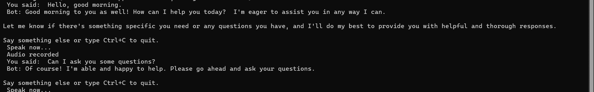

#  Voice Chatbot (Whisper + Cohere)

This is a simple voice-based chatbot built with Python.  
It listens to your voice , transcribes it using Whisper (speech-to-text), sends it to Cohere (text generation), and speaks back the response .

---

##  Demo


[Watch short demo video](demo.mp4)
>  **Note:** The user's voice has been muted in the demo video for privacy reasons.

---

##  Features

-  Voice input from your microphone
-  Automatic transcription using Whisper
-  AI-generated responses using Cohere API
-  Text-to-speech reply using pyttsx3

---

##  How It Works

1. The bot records 5 seconds of your voice.
2. It uses Whisper to transcribe what you said.
3. The transcription is sent to Cohere to generate a relevant reply.
4. The reply is printed and spoken aloud.

---

##  Installation

Before running the chatbot, you need to install the required Python packages.

1. Make sure you are using Python 3.10 or later.
2. Install all dependencies using the following command:

```bash
pip install -r requirements.txt
```
This command will install all the libraries needed, including Whisper, Cohere, PyTorch, and more.

If you face issues with torch, especially on CPUs, you can try:
```bash
pip install torch torchvision torchaudio --index-url https://download.pytorch.org/whl/cpu
```

---

##  Running the Bot
Simply run the Python file:

```bash
python voice_chatbot.py
```
Then speak into your microphone when prompted.

---
## Note about API Key
Make sure to place your own Cohere API key in this line in voice_chatbot.py:
```python
COHERE_API_KEY = "your own key here !"
```
! Do not share your real API key in public repositories.

---
## Exit the Chat
To end the program press Ctrl+C.

---
## Notes
+ Whisper may take a few seconds to process audio depending on your device.

+ You can adjust the recording time by changing DURATION in the code.

+ This is a basic prototype intended for demonstration or educational purposes.

---
## Project Files
|  purpose | file | 
|----------|----------|
|Main chatbot script |voice_chatbot.py	 |
| List of required Python packages  | requirements.txt	 |
|video demo of the project |demo.mp4|
|screenshot of the project |demo.png |
